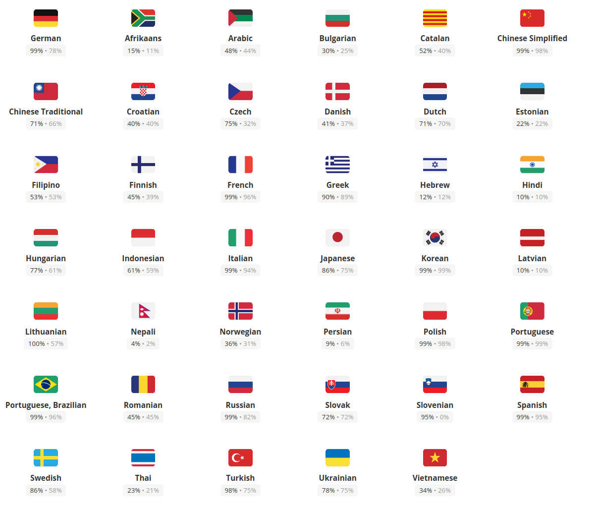

---
sidebar_navigation:
  title: Translations
description: Get an overview of how translations are being used in ProyeksiApp, and how they end up in the frontend
robots: index, follow
keywords: translations, I18n, localization, locales, languages
---

# Development concept: Translations

ProyeksiApp is currently being translated in over 40 languages. We use a cloud translation service called [Crowdin](https://crowdin.com/project/proyeksiapp) for allowing the community and professional translators to contribute translations to ProyeksiApp.

Not all translations are fully translated, and they will fallback to english strings for the untranslated portions.




## Key takeaways

*Translations in ProyeksiApp...*

- depend on the [I18n yaml-based Rails standard](https://guides.rubyonrails.org/i18n.html) for translation files
- are split into backend and frontend strings


## I18n definitions

The ProyeksiApp localizable strings are stored in the [Rails-standard I18n YAML files](https://guides.rubyonrails.org/i18n.html). The core only manages english source strings in `en.yml` and `js-en.yml` files. The can be found at `config/locales/en.yml` and `config/locales/js-en.yml`, respectively.

Additionally, modules can define their own translations, such as `modules/budgets/config/locales/en.yml`. 

The `js-en.yml` are not special on their own, but are simply prefixed with the `js:` key at the beginning of the file. This means all translations within are prefixed with the `js.` key. This is picked up by [`I18n.js`](https://github.com/fnando/i18n-js), a Ruby gem and frontend library that helps outputting javascript objects for the frontend. Only strings that are prefixed with `js.` and some internals will end up in the frontend due to the config we applied in [`config/i18n-js.yml`](https://github.com/opf/proyeksiapp/blob/dev/config/i18n-js.yml). The translations are output by the take task `./bin/rails i18n:js:export` and are output to `frontend/src/locales/{language}.js`.


## Using I18n in your Rails code

You are likely familiar already with the `I18n.t` helper provided by Rails. We simply use this helper to localize strings. Translations are simply loaded by Rails and available everywhere in the application.


Let's say want to add a specific label to a work package page and use that in a HTML ruby file, you should go through this way:

You have to add the below rows to the appropriate `en.yml` file. If you're editing a module, add the string to the module's `config/locales/en.yml` file.

You should prefix your string unless its something very generic:


```yaml
# ...
work_packages:
  my_specific_page:
  	my_button: "My localized button label"
```


You can then use the `t()` helper method in the Rails erb view to translate the string:

```html
<%= styled_button_tag t('work_packages.my_specific_page.my_button') %>
```


Outside of the views and controllers, you need to use the module function `I18n.t` to be used, for example in Ruby tests:

```ruby
expect(page).to have_selector('button', text: I18n.t('work_packages.my_specific_page.my_button'))
```


The Rails guide on translations will give advanced examples on variable interpolation and the like: https://guides.rubyonrails.org/i18n.html


## Using I18n in your frontend code

The frontend receives all translations prefixed with `js.` (see above) through compiled javascript files from `frontend/src/locales/{language}.js` folder generated by I18n.js. These locales are loaded early on in the application in [frontend/src/main.ts](https://github.com/opf/proyeksiapp/blob/dev/frontend/src/main.ts) to ensure they are present when the page loads. The import happens dynamically so only the language the user has selected is going to be loaded by webpack.


If you want to create an angular component named ‘news’ and translate the text of a "save news" button and author of the news, you should go through this way:

You have to add the below (exemplary) entry to the `js-en.yml` file

```yaml
js:
  # ... other values
  news:
    button_save: "Save news"
    label_added_by: "Added by %{author}"
```


You will then need to access the Angular [ `I18nService`](https://github.com/opf/proyeksiapp/blob/dev/frontend/src/app/modules/common/i18n/i18n.service.ts) that provides access to the `I18n.js` helper. Right now, there is also a window global `I18n` that works, but it is not recommended to use that wherever you can inject the service instead.


In the `news.component.ts`, you should import the `I18nService`. Then you have to define a property named ‘text’ used for all text in your component, like below:

```typescript
public text = {
  saveButton: this.I18n.t('js.news.button_save'),
  addedBy: (news:NewsResource) => this.I18n.t('js.news.label_added_time_by', { author: news.author}
};
```


Then you can use them as below in your template:

```html
<button type="submit" class="button -highlight">
  <span class="button—text" [innerText]=”text.saveButton”></span>
</button>

<div *ngIf="news.author" class="news-author">
  <span [innerText]="text.addedBy(news)"></span>
</div>
```


For more information on formatting and other helpers of the `I18n.js` library, see https://github.com/fnando/i18n-js