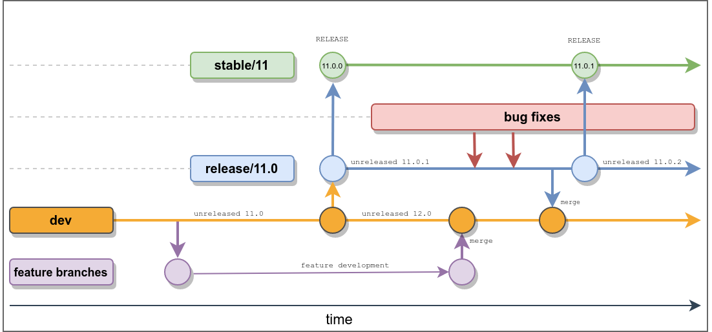

---
sidebar_navigation:
  title: Development workflow
description: How new features and bug fixes are developed at ProyeksiApp
robots: index, follow
keywords: development workflow, gitflow, git flow
---


# Development at GitHub

This guide will introduce you to how we at ProyeksiApp develop ProyeksiApp with Git, and how to contribute code. For other ways on how to contribute to ProyeksiApp, [please see the contribution guide](../#contributor-code-of-conduct).

The ProyeksiApp core is developed fully at our GitHub repository at https://github.com/opf/openproject. In the course of this guide, we assume that you are familiar with Git. If you need a refresher on certain topics, we recommend the [free Pro Git online book](https://git-scm.com/book/en/v2) as a resource for all topics on Git.


# Branching model

ProyeksiApp works with a git branching model similar to Git Flow to organize development and stable branches. The important branches are:


- **`dev`**:  Contains the current development version of ProyeksiApp. Almost all development is made against this branch, with the exception of [bugfixes and minor changes](#bugs-and-hotfixes)
- **`release/X.Y`**:  Multiple of these branches may exist, they are maintenance branches or maintained or stale older releases of ProyeksiApp. These branches will include bugfixes and changes for the next patch release of ProyeksiApp.
- **`stable/X`**:  Multiple of these branches exist containing the latest stable `X.y.z` release of ProyeksiApp. These branches are used for building docker images and packages from and are usually never pushed to directly except during an automated release process.
- **`feature/X`**: These are temporary branches used by developers to develop features or other changes that are targeting the dev branch. They are opened as a pull request for reviewing and testing. When they are ready to merge, they will be merged into the `dev` branch.
- **`(bug)fix/X`**: These are temporary branches used by developers to provide bug fixes and regression tests. They can be created against `dev` on a new major or minor release during stabilization, but most often, you will want to create a bugfix against a current production release. In this case, open the pull request against the most recent `release/X.Y` branch so that the bugfix will be available in the immediate next patch release. Ensure that the version of the corresponding ProyeksiApp bug ticket matches the release branch version.


The following is an overview of the processes that happen during the release of a new major release and the bug fixing phase afterwards leading to patch releases being made.



# Contribution flow

The basic overview of how to contribute code to ProyeksiApp is as follows.

1. [Fork the ProyeksiApp repository](#fork-openproject) and create a local development branch
2. Develop your change. Please see the sections on [development concepts](../concepts/) for further information on development topics.
3. [Create a pull request](#create-a-pull-request) on our repository.  Please see and review [code style and review](../code-review-guidelines) for guidelines on how to submit a pull request and requirements for getting your changes merged.
4. We will evaluate your pull review and changes.


## Fork ProyeksiApp

For contributing source code, please follow the git workflow below:

- Use GitHub UI to fork the [ProyeksiApp repository](https://github.com/opf/openproject) https://github.com/opf/openproject.
- Clone your fork to your development machine:

```
git clone git@github.com/<username>/openproject
```

Make sure you're on the right branch. The main development branch is `dev`:

```
git checkout dev
```

Add the original ProyeksiApp repository as a remote, so you can fetch changes:

```
git remote add upstream git@github.com:opf/openproject
```

Update your local git branch to the core branch

```
git pull upstream/dev
```

Create a feature branch:

```
git checkout -b feature/<short description of your feature>
```

Make your changes, then push the branch into your **own** repository:

```
git push origin <your feature branch>
```


## Create a Pull Request

Create a pull request against a branch of of the <opf/openproject> repository, containing a **clear description** of what the pull request attempts to change and/or fix.

If your pull request **does not contain a description** for what it does and what it's intentions are, we will reject it. If you are working on a specific work package from the [list](https://community.openproject.com/projects/openproject/work_packages), please include a link to that work package in the description, so we can track your work.

The core contributor team will then review your pull request according to our [code review guideline](../code-review-guidelines/). Please note that you can add commits after the pull request has been created by pushing to the branch in your fork.


### Features

New features are always added to the current `dev` branch, which is the development version of the next major or minor ProyeksiApp version.


### Bugs and hotfixes

Bugfixes for one of the actively supported versions of ProyeksiApp should be issued against the respective branch. For that, we maintain at least one `release/X.Y` branch for ProyeksiApp releases X.Y.Z. For example, the ProyeksiApp release branch for 11.0 would be `release/11.0` and contains all releases between `11.0.0` until `11.0.X` .

 A fix for the current version (called "Hotfix" and the branch ideally being named `fix/XYZ`) should target `release/*` and a fix for the former version (called "Backport" and the branch ideally being named `backport/XYZ`) should target `backport/*`. We will try to merge hotfixes into dev branch but if that is no trivial task, we might ask you to create another PR for that.

