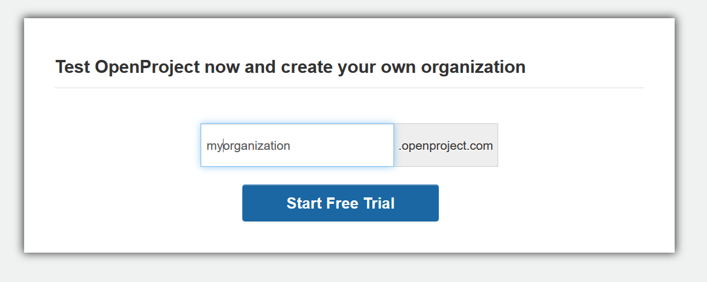

---
sidebar_navigation:
  title: Create trial installation
  priority: 998
description: Create a free ProyeksiApp Cloud Edition trial installation.
robots: index, follow
keywords: trial installation
---

# Create an ProyeksiApp trial installation

You can easily set up a **14 days free trial** for the ProyeksiApp Enterprise cloud edition.

Here you can test all ProyeksiApp functionalities thoroughly. After 14 days the trial will expire automatically, there is no further action nor cancellation required from your side. So, you have all freedom to test ProyeksiApp unconcernedly.

## Start a new trial installation

To create a new ProyeksiApp trial either go to the [ProyeksiApp website](https://www.proyeksi.id/) or open the [start trial page](https://start.proyeksiapp.com).

**Enter your organization name**. This name will become part of the URL of your ProyeksiApp installation, for example *myorganization.proyeksiapp.com*.

You can include a hyphen "-" in the organization name, e.g. *my-new-organization.proyeksiapp.com*.

Click the Start Free Trial button.

You will then be asked to [**create an ProyeksiApp account**](../../../getting-started/sign-in-registration/#create-a-new-account).

1. Enter your first and last **name**. 
2. Enter your **e-mail address**.
3. Choose a **password** and confirm the password. The password must at least be 10 characters long and needs to contain at least two of the following classes, uppercase letters, lowercase letters, special characters, numbers.
4. Please confirm the ProyeksiApp [privacy policy](https://www.proyeksi.id/legal/privacy/) and the [terms of service](https://www.proyeksi.id/legal/terms-of-service/).
5. You can subscribe to the ProyeksiApp **newsletter** where you will receive important updates about product, features, or new releases.
6. Click the **create new account button**.
7. Alternatively, you can login with an existing Google account by clicking the **Sign up with Google button**.

Your ProyeksiApp instance will be created and you will be directed to your ProyeksiApp installation.

## Frequently asked questions (FAQ)

### My ProyeksiApp Enterprise cloud trial expired – can I still access my data?

Due to data privacy reasons we automatically delete ProyeksiApp trial environments a couple of weeks after they have expired.
If your ProyeksiApp trial is not accessible through the known URL, it has likely been deleted.
You can easily [create a new ProyeksiApp trial environment](https://start.proyeksiapp.com/). Simply enter your organization name (you can use the same name as before) and click on "Start Free Trial".
In order to avoid that your data is getting deleted, please select a plan during your trial duration or shortly after your ProyeksiApp trial environment has expired.
