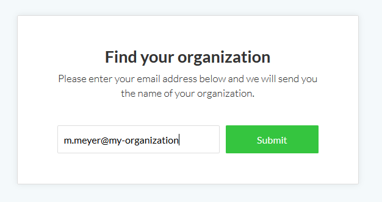

---
sidebar_navigation:
  title: Sign in
  priority: 997
description: Sign in to your ProyeksiApp Cloud Edition.
robots: index, follow
keywords: sing in
---

# Sign in to the ProyeksiApp Enterprise cloud edition

Login to your ProyeksiApp Enterprise cloud via the website or by entering directly the URL of your ProyeksiApp instance.

If you do not have an ProyeksiApp Enterprise cloud edition, you can [set up your own ProyeksiApp instance](../create-cloud-trial).

## Sign in via the ProyeksiApp website

In order to sign in to your ProyeksiApp Enterprise cloud edition via our website, navigate to [www.proyeksi.id](https://www.proyeksi.id/) and click the **Sign in button** at the top of the page.

You are asked to enter your ProyeksiApp organization name. This is the name that appears in the first part of the URL, e.g. my-organization.proyeksiapp.com.

Click the green **Sign in button** and you will be logged into your ProyeksiApp installation.

## Forgot organization name of ProyeksiApp Enterprise cloud

If you forgot the URL or the organization name of your ProyeksiApp Enterprise cloud edition and need to find your organization, you can click the **Find your organization** link on the Sign in page of the website.

You will then be asked to enter your e-mail address with which you signed in to ProyeksiApp.

Click the Submit button to get an email with further information.

You will receive an email from ProyeksiApp with the installations you are currently member of.

Click the link in the email to get directed to your installation. If you are member of several ProyeksiApp installations, they will all be listed in this email.

Watch this video about sign in and registration:

<video src="https://proyeksiapp-docs.s3.eu-central-1.amazonaws.com/videos/ProyeksiApp-Sign-in-and-Registration-2.mp4" type="video/mp4" controls="" style="width:100%"></video>