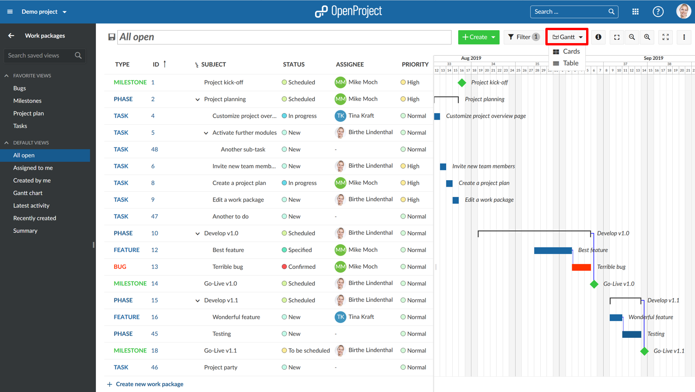
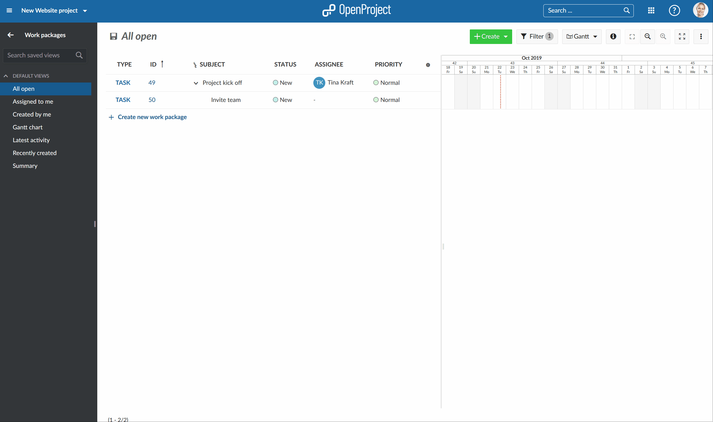
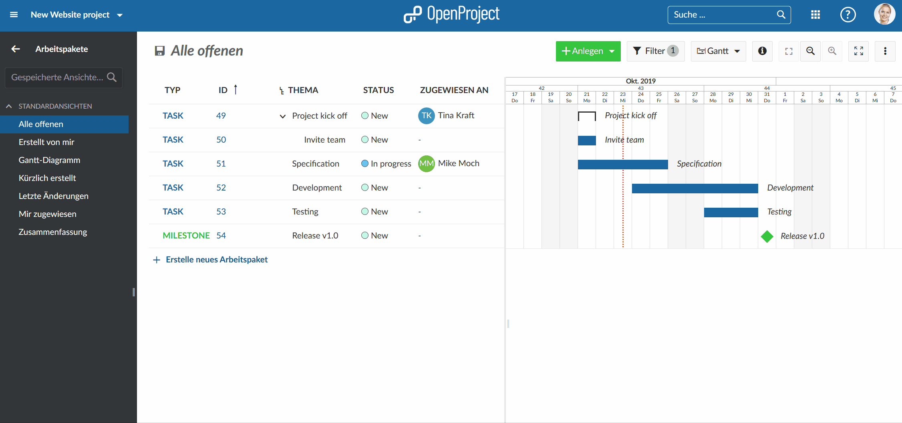

---
sidebar_navigation:
  title: Gantt charts introduction
  priority: 600
description: Introduction to Gantt charts to ProyeksiApp.
robots: index, follow
keywords: Gantt charts introduction
---

# Introduction to Gantt charts

In this document you will get a first introduction to the Gantt charts in ProyeksiApp, i.e. to create and manage a project plan.

**Gantt charts** in ProyeksiApp are defined as a type of bar chart that shows all the tasks constituting a project. Tasks are listed vertically, with the horizontal axis marking time. The lengths of task bars are to scale with task durations.

To find out more about the functionalities for Gantt charts, please visit our [user guide for Gantt charts](../../user-guide/gantt-chart).

| Feature                                                    | Documentation for                                    |
| ---------------------------------------------------------- | ---------------------------------------------------- |
| [What is a Gantt chart?](#what-is-a-gantt-chart)           | Find out what is a Gantt chart in ProyeksiApp.       |
| [Activate the Gantt chart](#activate-the-gantt-chart-view) | How to activate the Gantt chart view in ProyeksiApp? |
| [Create a project plan](#create-a-project-plan)            | How to create a project plan with the Gantt charts?  |
| [Edit a project plan](#edit-a-project-plan)                | How to edit a project plan in ProyeksiApp?           |

<video src="https://proyeksiapp-docs.s3.eu-central-1.amazonaws.com/videos/ProyeksiApp-Project-Plan-and-Timelines-Gantt-charts.mp4" type="video/mp4" controls="" style="width:100%"></video>

## What is a Gantt chart?

With Gantt charts in ProyeksiApp you can create and manage a project plan and share the information with your team. You can schedule your tasks and visualize the required steps to complete your project. As a project manager you are directly informed about delays in your project and can act accordingly.

The dynamic Gantt chart in ProyeksiApp displays the phases and milestones in your project as well as relationships between them. Each element in the timeline has both a start as well as a finish date so you are always informed about the current status.

## Activate the Gantt chart view

To open the Gantt chart view in ProyeksiApp, the [work packages module needs to be activated](../projects/#advanced-project-settings) in the project settings.

Within your project menu, navigate to the work packages module. Select the **Gantt chart view** in the work package list with the button on the top right.

You can activate a Gantt chart view from any work package list (or saved query) by selecting the Gantt view from the top.

The Gantt chart then displays all work package types, e.g. phases and milestones, tasks or bugs, in a timeline view.

It shows dependencies between different work packages as well as additional information, e.g. subject, start or due dates.

## Create a project plan

To create a project plan in ProyeksiApp, activate the work package module and select the [Gantt chart view](#activate-the-gantt-chart-view).

You can create new work packages directly in the list by clicking on the **create new work package** link at the bottom of the list. You can change the work package type or other attributes directly in the list view.

Click in the Gantt chart to add an element in the project plan.

You can change the duration or move the element in the project plan via drag and drop.

## Edit a project plan

You can edit a project plan by clicking directly in the list and change work package attributes, e.g. Status, Priority or Assignee.

To change the start and end date or the duration of a work package, click directly in the Gantt chart and change it via drag and drop.
All changes will also be tracked in the work packages [Activity](../../user-guide/activity).

